### Mgs. M. Rizqi. Fadhlurrahman

I’m currently building [**Rasylva.id**](https://rasylva.id/) and [**Webstorio**](https://webstorio.com/), focusing on turning ideas into maintainable, scalable, and well-crafted web products.

I have 10+ years of experience in web development and software engineering, including 8.5 years at Bukalapak, where I grew from a fresh graduate Frontend Engineer into a Senior Software Engineer. During that time, I contributed to Mitra, B2B, financing, and payment platforms used by millions of users. My work covered user activation, wallets, top-up, virtual products, wholesale, payments, QRIS, Kirim Uang, and device-based payments (EDC & Soundbox), helping drive IDR trillions of GMV. I worked across frontend architecture, system design, performance, SEO, CI/CD, and security.

I enjoy operating at the intersection of engineering, product, and operations. This includes leading technical initiatives, writing documentations, mentoring engineers, handling critical incidents, and unblocking teams as systems grow in scale and complexity.

I also have been doing some web development projects for my clients. I always seek for improvements on something I love. The good thing is, I love to write lines of code. Whether to build something useful and beautiful at the same time or just tinkering around with something interesting to make it more effective and efficient.

<h4 align="center">Languages and Tools</h4>

  <code></code>
  <code></code>
  <code></code>
  <code></code>
  <code></code>
  <code></code>
  <code></code>
  <code></code>
  <code></code>
  <code></code>
  <code></code>
  <code></code>
  <code></code>
  <code></code>
  <code></code>
  <code></code>
  <code></code>
  <code></code>
  <code></code>
  <code></code>
  <code></code>
  <code></code>
  <code></code>

  
   
  
   
  
   
  

   
   
   
  
  
  
  
  
  

  <h4>Build a website with AI. Keep it maintainable forever.</h4>
  

    
  

  

    
  

  

    <a href="https://webstorio.com/">webstorio.com</a> — AI website builder with CMS, store, forms, auth, analytics &amp; hosting built in.
  

